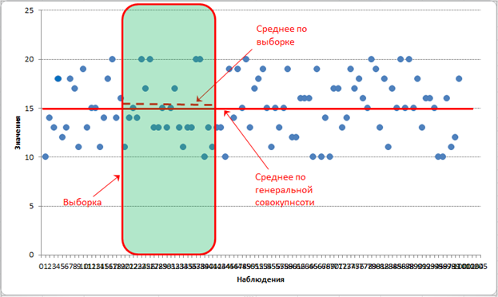

```{r setup, include=FALSE}

```

# Variance
# Дисперсия случайной величины

Дисперсия случайной величины — мера разброса данной случайной величины, то есть её отклонения от математического ожидания. Обозначается $D[X]$ в русской литературе и $Var(X)$ (англ. variance) в зарубежной. В статистике часто употребляется обозначение $\sigma _{X}^{2}$ или $\sigma^2$.

Квадратный корень из дисперсии, равный $\sqrt{\sigma}$, называется среднеквадрати́ческим отклоне́нием, станда́ртным отклоне́нием или стандартным разбросом. Стандартное отклонение измеряется в тех же единицах, что и сама случайная величина, а дисперсия измеряется в квадратах этой единицы измерения.

Из неравенства Чебышёва следует, что вероятность того, что случайная величина отстоит от своего математического ожидания более чем на $k * \sigma$  стандартных отклонений, составляет менее $1/k^2$. В специальных случаях оценка может быть усилена. Так, например, как минимум в 95 % случаев случайная величина, имеющая нормальное распределение, удалена от её среднего не более чем на два стандартных отклонения, а в примерно 99,7 % — не более чем на три.

Если случайная величина ${\displaystyle X}$ дискретная, то:

$D[X]=\sum\limits_{i=1}^n p_i(x_i - M[X])^2$

Если случайная величина ${\displaystyle X}$  непрерывна, то: 

$D[X]={\displaystyle\int\limits_{-\infty}^\infty}f(x)(x-M[X])^2$

Удобная формула для вычисления смещённой оценки дисперсии (англ. __biased sample variance__) случайной величины ${\displaystyle X}$ по последовательности ${\displaystyle X_{1}...X_{n}}$ — реализаций этой случайной величины: 

$s = \sqrt{\frac{1}{n-1} \sum_{i=1}^n (x_i - \overline{x})^2}$

[studme.org](http://studme.org/50291/psihologiya/dispersiya_otsenka)

Иными словами, дисперсию можно определить как математическое ожидание квадрата отклонения случайной величины от ее математического ожидания. Пользуясь этим определением, можно попытаться найти оценку для дисперсии (обозначим ее как $s^2$), используя среднее арифметическое в качестве оценки такого математического ожидания. Очевидно, что это можно сделать следующим образом:

$s^2 = \frac{\sum_{i=1}^n (x_i - \overline{x})^2}{n}$ (1.3)

где $x_i$ – наблюдаемые значения интересующей нас случайной переменной; $n$ – объем выборки, т.е. число собранных эмпирических значений $\overline{x} = \frac{\sum_{i=1}^n x_i}{n}$ – оценка для математического ожидания (среднее арифметическое __по выборке__).

Однако, как оказывается, если оценка математического ожидания, проведенная по формуле 

$\overline{x} = \frac{\sum_{i=1}^n x_i}{n}$ (1.2), 

является несмещенной, т.е. ее ожидаемое значение как раз равняется величине математического ожидания, то оценка дисперсии, выполненная по формуле (1.3), таковой не является. Оценка дисперсии является на самом деле выборочной, но не популяционной. Иными словами, эта оценка характеризует величину дисперсии только для данной выборки, но не для всей популяции данных (генеральной совокупности). И это вполне понятно – ведь сравнение значений случайной величины осуществляется не относительно истинного значения математического ожидания, как это предполагает само определение дисперсии, а лишь относительно его более или менее точной, пусть и несмещенной, оценки. Обычно в эксперименте бывает важным оценить именно популяционные характеристики математического ожидания и дисперсии.

Таким образом, вследствие того, что процедура, задаваемая по формуле (1.3), предполагает сравнение эмпирических значений х не с истинной величиной математического ожидания μ (которая практически никогда не бывает известна – ведь это лишь теоретическая величина), а только с ее оценочной характеристикой, происходит смещение оценки дисперсии. Методами дифференциального исчисления установлено, что ожидаемая величина оценочного значения дисперсии, рассчитанной по формуле (1.3), описывается следующим соотношением:

$E(s^2) = \frac{n - 1}{n} \cdot \sigma^2$ (1.4)

Таким образом, получается, что если у нас есть десять выборочных значений какой-либо случайной величины, то, как показывает уравнение (1.4), оценивая дисперсию по формуле (1.3), мы занижаем ее значение, получая лишь 9/10 дисперсии исследуемой величины для генеральной совокупности. Увеличив объем выборки в десять раз, мы сможет уменьшить величину смещения до одной сотой, но все равно полученная величина будет отличаться от ожидаемого значения дисперсии. Однако, руководствуясь формулой (1.4), несложно найти способ расчета __несмещенной оценки дисперсии__:

$\hat{s}^2= {\displaystyle\frac{\sum_{i=1}^n(x_i-\bar{x})^2}{n-1}} = \displaystyle\frac{n}{n}\frac{\sum_{i=1}^n(x_i-\bar{x})^2}{n-1} = \displaystyle\frac{n}{n-1}\frac{\sum_{i=1}^n(x_i-\bar{x})^2}{n} = \displaystyle\frac{n}{n-1}\sigma$  (1.5)

Оценка дисперсии, представленная формулой (1.5), называется __популяционной дисперсией__, или дисперсией для __генеральной совокупности__, тогда как оценка дисперсии, полученная по формуле (1.3), называется __выборочной__. Таким образом, если мы хотим оценить этот параметр распределения случайной величины в какой-либо генеральной совокупности, мы должны воспользоваться формулой (1.5), тогда как формула (1.3) может быть использована, когда требуется лишь определить степень вариативности данных внутри выборки и выход за пределы имеющихся значений не предполагается даже в теории.

Иногда бывает важным оценить не столько дисперсию случайной величины, т.е. величину $\sigma^2$, сколько саму $\sigma$. Этот параметр принято называть стандартным отклонением. Аналогично оценке дисперсии оценка стандартного отклонения может проводиться как для выборки, так и для генеральной совокупности. Кроме того, стандартное отклонение используется при вычислении стандартной ошибки измерения (SE):

$SE = \frac{\sigma}{\sqrt{n}}$

[statanaliz.info](http://statanaliz.info/metody/opisanie-dannyx/15-vyborochnaya-dispersiya)

### Понятие о сплошном и выборочном наблюдении

С точки зрения охвата объекта исследования, статистический анализ можно разделить на два вида: сплошной и выборочный. 

__Сплошной__ статанализ предполагает изучение генеральной совокупности данных, то есть всего явления во всем его многообразии без распространения выводов на другие элементы, не входящие в анализируемую совокупность. Из названия данного типа явствует, что наблюдению подвергаются тотально все элементы. Результат анализа распространяется на всю генеральную совокупность без каких-либо допущений и поправок на ошибку. Данный тип статистического исследования является наиболее полным и точным, так как дополнительные знания почерпнуть уже неоткуда – информация собрана со всех элементов объекта исследования. Это бесспорный плюс.

В противовес сплошному придумали __выборочное__ наблюдение. Название метода точно отражает его суть: из генеральной совокупности отбирается и анализируется только часть данных, а выводы распространяют на всю генеральную совокупность. Отбор данных происходит таким образом, чтобы выборка была репрезентативной, то есть, сохранила внутреннюю структуру и закономерности генеральной совокупности. Если это условие не соблюдено, то дальнейший анализ во многом теряет смысл.

Сам анализ выборочных данных происходит так же, как и при сплошном наблюдении (рассчитываются различные показатели, делаются прогнозы и т.д.), только с поправкой на ошибку. Это значит, что рассчитывая тот или иной показатель, мы понимаем, что при повторной выборке его значение всегда будет иным. К примеру, провели опрос общественного мнения об отношении к кандидатам в президенты. Опрос показал, что за кандидата N желают проголосовать 60% опрошенных. Если провести еще один такой же опрос, даже в том же месте, то результат будет отличаться. То есть, взяв первое значение 60%, следует понимать, что с той или иной вероятностью оно могло быть, скажем, и 55%, и 65%. Точность и разброс выборочных показателей зависят от характера данных.

Пример изменчивости [средней](http://statanaliz.info/metody/opisanie-dannyx/3-vvedenie-v-srednie-velichiny) рассмотрен в статье о [качестве средней величины при маленьком объеме данных](http://statanaliz.info/metody/opisanie-dannyx/8-srednie-velichiny-malaya-vyborka). Там как раз речь идет о том, что средняя величина постоянно меняется и для решения проблемы предлагается увеличить выборку. Большая выборка, бесспорно, дает более надежные результаты, чем маленькая, но даже в этом случае ошибка сохранится, только станет меньше. А иногда и выбора нет, приходится иметь дело с маленькими выборками.

У выборочного наблюдения есть один существенный плюс и один минус, однако по сравнению со сплошным наблюдением крайности меняются местами. Плюс заключается в том, что для проведения выборочного обследования требуется гораздо меньше ресурсов. Минус – в том, что выборочное наблюдение всегда ошибочно. Поэтому основная задача проведения выборочного наблюдения – добиться максимальной точности при приемлемых затратах на его проведение.

И вот, стало быть, дисперсия. Дисперсия, как и доля или средняя арифметическая, также меняет свое значение от выборки к выборке, но здесь есть интересная особенность. Дисперсия ведь рассчитывается от средней величины, а она в свою очередь тоже рассчитывается по выборке, то есть является ошибочной. Как же это обстоятельство влияет на саму дисперсию?

Если бы мы знали истинную среднюю величину (по генеральной совокупности), то ошибка дисперсии была бы связана только с нерепрезентативностью, то есть с тем, что данные в выборке оказались бы ближе или дальше от средней, чем в целом по генеральной совокупности. При этом при многократном повторении данные стремились бы к своему реальному расположению относительно средней.

Выборочный показатель, который при многократном повторении выборки стремится к своему теоретическому значению, называется __несмещенной__ оценкой. Почему оценкой? Потому что мы не знаем реальное значение показателя (по генеральной совокупности), и с помощью выборочного наблюдения пытаемся его оценить. Оценка показателя – это есть его характеристика, рассчитанная по выборке.

Теперь смотрим внимательно на __выборочную среднюю__. Выборочная средняя – это __несмещенная__ оценка __математического ожидания__, так как средняя из выборочных средних стремится к своему теоретическому значению по генеральной совокупности. Где она расположена? Правильно, в центре выборки! Средняя всегда находится в центре значений, по которым рассчитана – на то она и средняя. А раз выборочная средняя находится в центре выборки, то из этого следует, что сумма квадратов расстояний от каждого значения выборки до выборочной средней всегда меньше, чем до любой другой точки, в том числе и до генеральной средней. Это ключевой момент. А раз так, то дисперсия в каждой выборке будет занижена. Средняя из заниженных дисперсий тоже даст заниженное значение. То есть при многократном повторении эксперимента выборочная дисперсия не будет стремиться к своему истинному значению (как выборочная средняя), а будет смещена относительно истинного значения по генеральной совокупности.

Отклонение выборочной средней от генеральной показано на рисунке.

<div id="bg">
  
</div>  



Несмещенность оценки – одна из важных характеристик статистического показателя. Смещенная оценка показателя заранее говорит о тенденции к ошибке. Поэтому показатели стараются оценивать таким образом, чтобы их оценки были несмещенными (как у средней арифметической). Для того, чтобы решить проблему смещенности оценки выборочной дисперсии в ее расчет вносят корректировку – домножают на $\frac{n}{n-1}$, либо сразу при расчете в знаменатель ставят не $n$, а $n-1$. Получается так.

Выборочная __смещенная__ дисперсия (__biased__ sample variance):

$s^2 = {\displaystyle\frac{\sum_{i=1}^n (x_i - \overline{x})^2}{n}}$ 

Выборочная __несмещенная__ дисперсия (__unbiased__ sample variance):

$\hat{s}^2= {\displaystyle\frac{\sum_{i=1}^n(x_i-\bar{x})^2}{n-1}}$

[en.wikipedia.org - Bessel's correction](https://en.wikipedia.org/wiki/Bessel%27s_correction)

Предположим что генеральная средняя равна $\mu = 2050$, но мы об этом не знаем, и должны делать выводы по полученной выборке из генеральной совокупности:

$$
\begin{array}{ccccc}
 2051 & 2053 & 2055 & 2050 & 2051
\end{array}
$$

Можно подсчитать __выборочную__ среднюю:

$\bar{x} = {\displaystyle\frac{2051 + 2053 + 2055 + 2050 + 2051}{5}} = 2052$ 

Как видно - выборочная средняя $2052$ отличается от генеральной средней $\mu = 2050$. Теперь подсчитаем выборочную дисперсию. Выборочная __смещенная__ дисперсия:

$$
\begingroup
\def\arraystretch{2.2}
\begin{array}{ll}
s^2 &= {\displaystyle\frac{\sum_{i=1}^n (x_i - \overline{x})^2}{n}} =\\
  &= \displaystyle\frac{(2051 -2052)^2+ (2053-2052)^2 + (2055-2052)^2 + (2050-2052)^2 + (2051-2052)^2}{5} =\\
  &= \displaystyle\frac{16}{5} = 3.2
\end{array}
\endgroup
$$ 

Какая она должна бы быть, если бы мы знали генеральную среднюю $2050$:

$$
\begingroup
\def\arraystretch{2.2}
\begin{array}{ll}
s^2 &= {\displaystyle\frac{\sum_{i=1}^n (x_i - \overline{x})^2}{n}} =\\
    &= \displaystyle\frac{(2051 -2050)^2+ (2053-2050)^2 + (2055-2050)^2 + (2050-2050)^2 + (2051-2050)^2}{5} =\\
    &= \displaystyle\frac{36}{5} = 7.2
\end{array}
\endgroup
$$

> Теперь небольшое отступление перед последующими преобразованиями Выборочной __смещенной__ дисперсии.
> На примере квадрата суммы 
>
> $(a+b)^2 = a^2 + 2ab + b^2$
>
> и разности в квадрате 
>
> $(a-b)^2 = (b-a)^2$
>
> $(a-b)^2 = a^2 - 2ab + b^2 = b^2 - 2ab + a^2 = (b-a)^2$
>
> будем производить переобразования. Поставим в скобку настоящую *"известную"* генеральную среднюю:
>

$(2051 -2050)^2 = (2051 -2050 \overbrace{+2052 -2052}^{+\bar{x} -\bar{x}})^2 = ((2051 -2052) +(2052 -2050))^2 =$

$(\overbrace{(2051 -2052)}^a +\overbrace{(2052 -2050)}^b)^2 =$ 

$\overbrace{{(\underbrace{2051 -2052}_{x_i-\bar{x}})}^2}^{a^2} +\overbrace{2(\underbrace{2051 -2052}_{x_i-\bar{x}})(2052 -2050)}^{2ab}+ \overbrace{{\underbrace{(2052 -2050)}_{\bar{x}-\mu}}^2}^{b^2}$

> Проделаем это для всех наших данных - 2051, 2053, 2055, 2050, 2051:

$$
\begin{array}{ccc}
\overbrace{(2051 -2052)^2}^{a^2} & +\overbrace{2(2051-2052)(2052 -2050)}^{2ab} &+\overbrace{(2052 -2050)^2}^{b^2}\\
(2053 -2052)^2 & +2(2053-2052)(2052 -2050) &+(2052 -2050)^2\\
(2055 -2052)^2 & +2(2055-2052)(2052 -2050) &+(2052 -2050)^2\\
(2050 -2052)^2 & +2(2050-2052)(2052 -2050) &+(2052 -2050)^2\\
(\underbrace{2051 -2052}_{x_i-\bar{x}})^2 & +\underbrace{2\underbrace{(2051-2052)}_{\sum_{i=1}^n(x_i-\bar{x}) =0}(2052 -2050)}_{2 * 0 * любое число = 0} &+(\underbrace{2052 -2050}_{\bar{x}-\mu})^2\\
\end{array}
$$

> Как видно выше $2ab$ исчезает всегда. И разница между генеральной выборкой и полученной определяется квадратами разниц между выборочным средним $\bar{x}$ и $\mu$. Чем меньше отклонение выборочной средней от генеральной средней $\bar{x}-\mu$ тем меньше последняя сумма. И если полностью совпадает то остаётся первое слагаемое с 

$\sum_{i=1}^n(x_i-\mu)^2$

> А это совпадает с вычислением генеральной совокупности.

После данного отступления возвращаемся к преобразованиям __выборочной__ дисперсии.

$$
\begin{array}{ll}
s^2 = \displaystyle{\frac{\sum_{i=1}^n (x_i - \overline{x})^2}{n}} & = \displaystyle{\frac{\sum_{i=1}^n (x_i - \overline{x} +\mu-\mu)^2}{n} = \frac{\sum_{i=1}^n[(x_i - \mu + \mu - \overline{x})]^2}{n}} =\\[2mm]
 & = \displaystyle{\frac{1}{n}{\sum_{i=1}^n[(x_i - \mu) - (\overline{x} -\mu)]^2}} =\\[2mm]
 & = \displaystyle{{\underbrace{\frac{1}{n}{\sum_{i=1}^n(x_i - \mu)^2}}_{\sigma^2}} - \frac{1}{n} *2\sum_{i=1}^n\big[(x_i - \mu)\overbrace{(\overline{x} -\mu)}^{const}\big] +  \frac{1}{n}\sum_{i=1}^n{ \overbrace{(\overline{x}-\mu)^2}^{const}  }} =\\[2mm]
 & = \displaystyle{\sigma^2 - \frac{2}{n}(\overline{x} -\mu)\sum_{i=1}^n(x_i - \mu) +  \frac{1}{n}* n(\overline{x} -\mu)^2} =\\[2mm]
 & = \displaystyle{\sigma^2 - 2(\overline{x} -\mu)\frac{\sum_{i=1}^n(x_i - \mu)}{n} + (\overline{x} - \mu)^2} =\\[2mm]
 & = \displaystyle{\sigma^2 - 2(\overline{x} -\mu)*\Bigg(\frac{\sum_{i=1}^n x_i}{n} - \frac{\sum_{i=1}^n \mu}{n}\Bigg) + (\overline{x} - \mu)^2} =\\[2mm]
 & = \displaystyle{\sigma^2 - 2(\overline{x} -\mu)*\Big(\overline{x} - \frac{n*\mu}{n}\Big) + (\overline{x} - \mu)^2} =\\[2mm]
 & = \displaystyle{\sigma^2 - 2(\overline{x} -\mu)(\overline{x} - \mu) + (\overline{x} - \mu)^2} =\\[2mm]
 & = \displaystyle{\sigma^2 - 2(\overline{x} -\mu)^2 + (\overline{x} - \mu)^2} =\\[2mm]
 & = \displaystyle{\sigma^2 - (\overline{x} -\mu)^2} = \\
\end{array}
$$ 

$$
\begin{array}{ l l l }
 & = \displaystyle{\sigma^2 - \bigg(\frac{\sum_{i=1}^n x_i}{n} -\frac{n*\mu}{n}\bigg)^2 = \sigma^2 - \bigg(\frac{(\sum_{i=1}^n x_i -n*\mu)}{n}\bigg)^2 = \sigma^2 - \frac{1}{n^2}\Big(\sum_{i=1}^n x_i -\sum_{i=1}^n \mu\Big)^2} = \\[2mm]
 & = \displaystyle{\sigma^2 - \frac{1}{n^2}\bigg(\sum_{i=1}^n (x_i - \mu)\bigg)^2} =\huge{⊜} \\[2mm]
\end{array}
$$


```{r}
# Квадрат суммы
```

[planetmath.org](http://planetmath.org/squareofsum)

$\displaystyle(a\!+\!b)^2 = a^2 + 2ab +b^2$

$\displaystyle(a +b +c)^2 = \overbrace{a^2 + b^2 + c^2}^{{x_i}^2} +\overbrace{2bc +2ca +2ab}^{2*x_i x_j}$

__Rule__. Квадрат Суммы равен Сумме Квадратов всех слагаемых плюс Удвоенные пары произведений этих слагаемых:

$\bigg(\sum_{i}a_{i}\bigg)^{2} = \sum_{i}a_{i}^{2}+ 2\sum_{{i<j}}a_{i}a_{j}$

Рассмотрим квадрат трех слагаемых: $(a + b + c)^2$

Представим его в таком виде: 

$$\bigg[(a + b) + c\bigg]^2$$

Если рассматривать $(a + b)$ как одно слагаемое, то мы можем применить формулу квадрата суммы для двух слагаемых:

$$\big[(a + b) + c\big]^2 = (a + b)^2 + 2(a + b)c + c^2 = a^2 + 2ab + b^2 + 2ac + 2bc + c^2$$

Итак в результате преобразования мы получили:

$$(a + b + c)^2 = {\overbrace{a^2 + b^2 + c^2}^{{x_i}^2}} + \overbrace{2ab + 2ac + 2bc}^{2*x_i x_j}$$

Если бы слагаемых было 4, то в результате преобразования выглядели так:

$$
\begingroup
\def\arraystretch{2.2}
\begin{array}{ll}
(a + b + c + d)^2 &= \bigg((a + b) + (c + d)\bigg)^2 =\\
 &= (a + b)^2 + 2(a+b)(c+d) + (c + d)^2 =\\
 &= a^2 + 2ab + b^2 + 2ac + 2ad + 2bc + 2bd + c^2 + 2cd + d^2
\end{array}
\endgroup
$$

В результате была бы получена следующая формула:

$$(a + b + c + d)^2 = \overbrace{a^2 + b^2 + c^2 + d^2}^{{x_i}^2} + \overbrace{2ab + 2ac + 2ad + 2bc + 2bd + 2cd}^{2*x_i x_j}$$

Вообще независимо от того, сколько слагаемых в квадрате суммы, при раскрытии скобок получается сумма квадратов всех слагаемых плюс удвоенные пары произведений этих слагаемых.

Это правило можно показать и таким образом:

$\displaystyle(a + b + c + ...)^2 = (a)a+(2a+b)b +(2a + 2b +c)c+...$

$\displaystyle(a + b + c + d)^2 = (a)a+ (2a+b)b + (2a+2b+c)c + (2a+2b+2c+d)d$

[math.stackexchange.com](http://math.stackexchange.com/questions/329344/what-is-the-square-of-summation)

$$
% outer vertical array of arrays
\begin{array}{ccccccc}
 \bigg(\sum\limits_{j=1}^{n}Z_j\bigg)^2 & = & \sum\limits_{j=1}^{n}Z_j^2 & + & \sum\limits_{i<j}Z_iZ_j & + & \sum\limits_{i>j}Z_iZ_j
\\
% inner array of minimum values
\begin{array}{c|cccc}
\ & a & b & c & d\\
\hline
a & \color{magenta}{a^2} & \color{red}{ab} & \color{blue}{ac} & ad\\
b & \color{red}{ba} & \color{magenta}{b^2} & \color{green}{bc} & bd\\
c & \color{blue}{ca} & \color{green}{cb} & \color{magenta}{c^2} & cd\\
d & da & db & dc & \color{magenta}{d^2}\\
\end{array}
& = &
\begin{array}{c|cccc}
\ & a & b & c & d\\
\hline
a & \color{magenta}{a^2} & & & \\
b & & \color{magenta}{b^2} & & \\
c & & & \color{magenta}{c^2} & \\
d & & & & \color{magenta}{d^2}\\
\end{array}
& + &
\begin{array}{c|cccc}
\ & a & b & c & d\\
\hline
a & & \color{red}{ab} & \color{blue}{ac} & ad\\
b & & & \color{green}{bc} & bd\\
c & & & & cd\\
d & & & & \\
\end{array}
& + &
% inner array of maximum values
\begin{array}{c|cccc}
\ & a & b & c & d\\
\hline
a & & & & \\
b & \color{red}{ba} & & & \\
c & \color{blue}{ca} & \color{green}{cb} & & \\
d & da & db & dc & \\
\end{array}
\end{array}
$$

$\bigg(\sum_{i=1}^{n}(a + b +c +d )\bigg)^2 = \underbrace{a^2 + b^2 +c^2 +d^2}_{x_i^2} +\underbrace{2ab + 2ac + 2ad + 2bc + 2bd + 2cd}_{*2x_ix_j}$


$$
\begin{array}{ccl}
\bigg(\sum\limits_{j=1}^{n}Z_j\bigg)^2 & = & \bigg(\sum\limits_{i=1}^{n}Z_i\bigg)\bigg(\sum\limits_{i=1}^{n}Z_j\bigg) =\\
 & = & \sum\limits_{j=1}^{n}Z_j\bigg(Z_j+\sum\limits_{j\neq i}Z_i\bigg) =\\
 & = & \sum\limits_{j=1}^{n}Z_j^2 + \sum\limits_{j\neq i}Z_iZ_j \huge{⊜} =\\
 & \huge{⊜} = & \sum\limits_{j=1}^{n}Z_j^2 + \bigg( \sum\limits_{j<i}Z_iZ_j + \sum\limits_{j>i}Z_iZ_j \bigg) =\\
 & = & \sum\limits_{j=1}^{n}Z_j^2 + 2\sum\limits_{j<i}Z_iZ_j
\end{array}
$$

[stats.stackexchange.com](http://stats.stackexchange.com/questions/100041/how-exactly-did-statisticians-agree-to-using-n-1-as-the-unbiased-estimator-for)

$$
\begin{array}{c}
\mbox{The degree to which}\\
X_{i}\mbox{ varies from }\bar{X}
\end{array}+\begin{array}{c}
\mbox{The degree to which}\\
\bar{X}\mbox{ varies from }\mu
\end{array}=\begin{array}{c}
\mbox{The degree to which }\\
X_{i}\mbox{ varies from }\mu
\end{array}
$$


$$
\mathbf{E}\left[\left(X_{i}-\bar{X}\right)^{2}\right]=\underset{\sigma^{2}}{\underbrace{\mathbf{E}\left[\left(X_{i}-\mu\right)^{2}\right]}}-\underset{\frac{\sigma^{2}}{n}}{\underbrace{\mathbf{E}\left[\left(\bar{X}-\mu\right)^{2}\right]}}=\frac{n-1}{n}\sigma^2
$$

$$
\mathbf{E}\left[\left(X_{i}-\bar{X}\right)^{2}\right]+\mathbf{E}\left[\left(\bar{X}-\mu\right)^{2}\right]=\mathbf{E}\left[\left(X_{i}-\mu\right)^{2}\right]
$$

[math.stackexchange.com](http://math.stackexchange.com/questions/439220/what-is-the-difference-between-square-of-sum-and-sum-of-square)

$n \sum_{i = 1}^{n} x_i^2  - \bigg ( \sum_{i = 1}^{n} x_i \bigg)^2 = \tfrac 12 \sum_{i = 1}^{n} \sum_{j = 1}^{n} (x_i - x_j)^2$

$\bigg(\sum_{i = 1}^{n} x_i \bigg)^2 = n \sum_{i = 1}^{n} x_i^2 - \tfrac 12 \sum_{i = 1}^{n} \sum_{j = 1}^{n} (x_i - x_j)^2$
